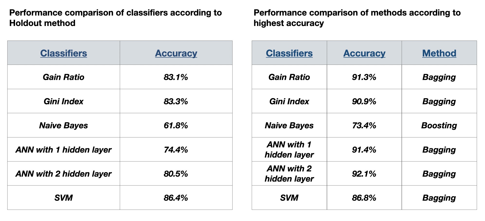

# dataMiningProject 

# Problem Definition
  - EEG Eye State identification is a kind of common classification problem.
  - The finding from these studies are important and useful for  human cognitive state classification. 
  - It can be use for:
    - Driving drowsiness detection
    - Epileptic seizure detection
    - Human eye blinking detection

# EEG Eye State!
  - The dataset consist of 14 EEG values and a value that indicate for the eye state. 
  - In usual case, the data describing EEG eye state belong to continuous type of time-series data.
  - All data is from EEG measurement with the Emotiv EEG Neuroheadset. 
  - EEG is an observing system of electrophysiology which records the electrical movement of the brain. 
  
# Dataset
  - There are 15 attributes. 14 are EEG values as shown as figure. And class label that is eyeDetection column. 
  - ‘1’ indicates the eye-closed and ‘0’ indicates the eye-open. 
  - Number of instances(rows) are 14980.
  - Number of attributes(columns) are 15. 
    
    
    
# Implementation Details 
 ## Classification Models and Applied Methods
 - Decision Tree using Gain Ratio: Holdout, bagging and boosting methods for Gain Ratio.
 - Decision Tree using Gini Index: Holdout, bagging and boosting methods for Gini Index.
 - Naive Bayes: Holdout, cross validation, bagging and boosting methods for Naive Bayes. 
 - Artificial Neural Network with 1 hidden layer: Holdout, bagging and boosting methods for ANN with 1 hidden layer. 
 - Artificial Neural Network with 2 hidden layer: Holdout, bagging and boosting methods for ANN with 2 hidden layer.
 - Support Vector Machines: Holdout, bagging and boosting methods for Support Vector Machines.
  
#Conclusion

   
